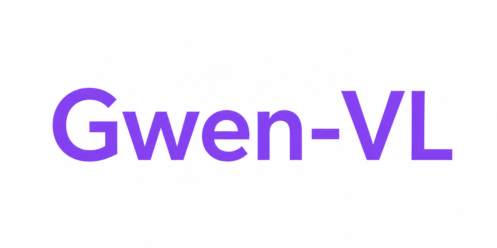
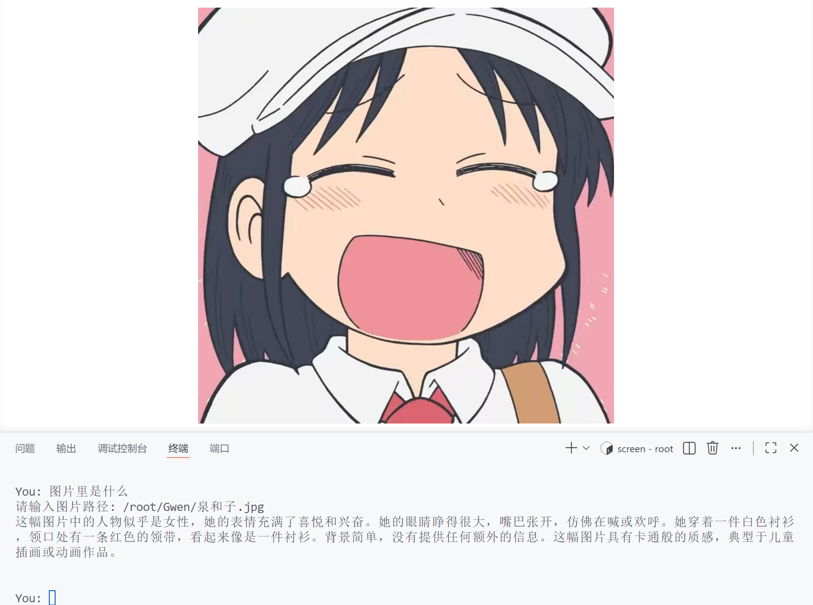
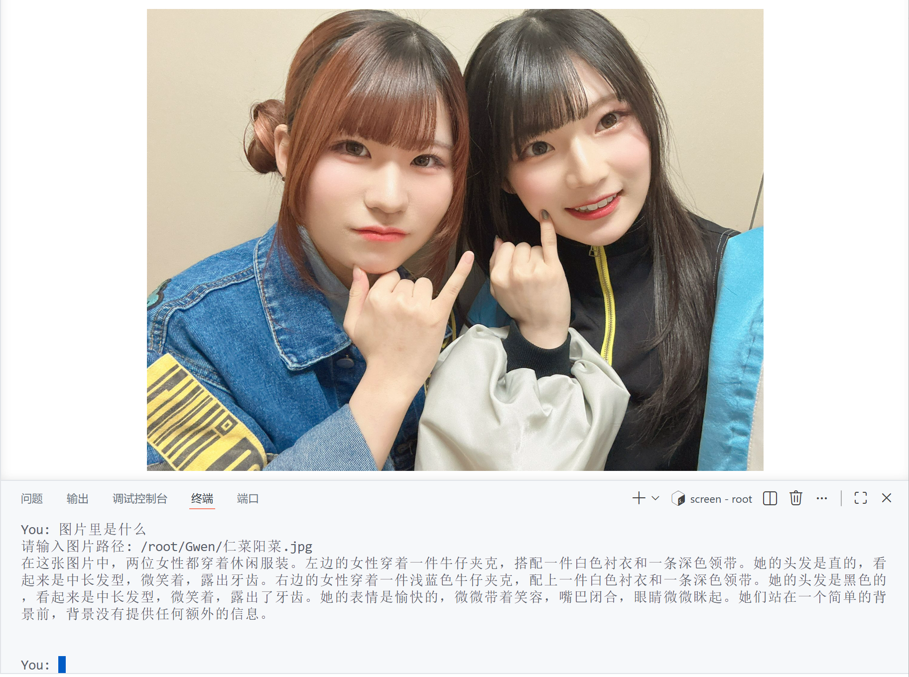

# Gwen-VL

+ Gwen-VL 是基于 [Gwen](https://github.com/juncheng0178-del/GWen) 扩展出来的轻量中文视觉语言模型实验项目,核心架构与Qwen3.5相同，但为了简单易懂忽略了许多工程细节。
+ 总参数约170M，可训练参数(主干)约80M，与[MiniMind](https://github.com/jingyaogong/minimind) / [MiniMind-V](https://github.com/jingyaogong/minimind-v)的参数量(60M)相当。

+ ⚠️ Gwen-VL对Gwen原项目的核心代码做了若干调整，故不能用Gwen原项目里的预训练模型或 sft 模型训练 vlm。


| 图片                                  | 回答                                                                                                                                                                                                                                                                                                                                                                                           |
| ------------------------------------- | ---------------------------------------------------------------------------------------------------------------------------------------------------------------------------------------------------------------------------------------------------------------------------------------------------------------------------------------------------------------------------------------------- |
|  | 这幅图片中的人物似乎是女性，她的表情充满了喜悦和兴奋。她的眼睛睁得很大，嘴巴张开，仿佛在喊或欢呼。她穿着一件白色衬衫，领口处有一条红色的领带，看起来像是一件衬衫。背景简单，没有提供任何额外的信息。这幅图片具有卡通般的质感，典型于儿童插画或动画作品。                                                                                                                                       |
|  | 在这张图片中，两位女性都穿着休闲服装。左边的女性穿着一件牛仔夹克，搭配一件白色衬衣和一条深色领带。她的头发是直的，看起来是中长发型，微笑着，露出牙齿。右边的女性穿着一件浅蓝色牛仔夹克，配上一件白色衬衣和一条深色领带。她的头发是黑色的，看起来是中长发型，微笑着，露出了牙齿。她的表情是愉快的，微微带着笑容，嘴巴闭合，眼睛微微眯起。她们站在一个简单的背景前，背景没有提供任何额外的信息。 |

## 更新日志

<details>
<summary>点击展开</summary>

### 2026-06

- 项目从 Gwen 文本模型扩展为 Gwen-VL。
- 新增 LLM SFT + VLM SFT 混合 batch 训练模式。
- 新增普通 RoPE / THW M-RoPE 选择。
- Full Attention RoPE 布局改为 Qwen3.5 风格 half-split。
- GDN 实现对齐Qwen3.5。
- 新增按 step 保存 checkpoint 与从 step checkpoint 恢复训练。
- 新增 `torch.compile` checkpoint 转普通 checkpoint 的转换脚本。

</details>

## 模型权重

| 名称                                                                                                                         | 说明                                 |
| ---------------------------------------------------------------------------------------------------------------------------- | ------------------------------------ |
| [`pretrain-rope-final_uncompiled_s.pth`](https://modelscope.cn/models/cind2100/Gwen-VL/pretrain-rope-final_uncompiled_s.pth) | 文本预训练底座                       |
| [`vlm_sft-mrope-final_uncompiled_s.pth`](https://modelscope.cn/models/cind2100/Gwen-VL/vlm_sft-mrope-final_uncompiled_s.pth) | llm&vlm sft数据集 混合微调出来的模型 |

[SigLIP2 视觉塔](https://modelscope.cn/models/gongjy/siglip2-base-p32-256-ve)不在其中，推理和训练时需要单独提供 `vision_model_path`。

## 模型介绍


Gwen-VL 由三部分组成：Gwen 文本主干、冻结的 SigLIP2 视觉塔，以及连接两者的视觉 projector。

### 文本主干

- 采用 `3 × GDN + 1 × Full Attention` 的混合结构。
- Full Attention 支持普通 Partial RoPE 和 M-RoPE；纯文本时 M-RoPE 退化为普通 Partial RoPE，因此同一份文本预训练权重可以继续用于 `rope` 或 `mrope` VLM 实验。

### 视觉接入

- 视觉塔使用 `gongjy/siglip2-base-p32-256-ve`，训练时冻结。
- 输入图像固定为 `256 × 256`，P32 patch 输出 `8 × 8 = 64` 个视觉 token。
- Projector 使用一层 `MLP`，把 SigLIP2 hidden 映射到 Gwen hidden。

### 图像 token 机制

- 有图输入会插入 `<|vision_start|> + 64 个 <|image_pad|> + <|vision_end|>`。
- 视觉特征会替换 `<|image_pad|>` 对应位置的 embedding。
- 无图输入不会插入视觉 token，也不会使用黑图占位；这点不同于 MiniMind-V 的黑图替代方式。

### 训练主线

- 一个 batch 中同时包含 LLM SFT 和 VLM SFT 样本，默认比例为 `1:3`。
- 当前实验使用 `mrope`。

## 对Gwen原项目的修改


### GDN 层对齐Qwen3.5

- GDN 层不使用 RoPE。
- GDN depthwise conv 不使用 bias。
- GDN gated norm 从 Gwen 原项目的先 gate 再 norm（`RMSNorm(output * silu(z))`），改为 Qwen3.5 风格的先 norm 再 gate（`RMSNorm(output) * weight * silu(z)`）。

### 其他修改

- Full Attention 的 RoPE 布局使用 Qwen 的 `rotate_half` 风格，不使用Gwen原有的 even/odd 相邻维度配对。（其实两种都是对的）
- 默认 `rotary_dim=64`，启用 `mrope` 时要求不小于 64。这是为了保证小模型3D M-RoPE里的THW每一维都有足够的rope容量，不采用Gwen里简单的前1/4维。
- 普通 RMSNorm 使用 zero-centered 参数化，真实缩放为 `1 + weight`。

**仍然保留的差异**包括层数、上下文长度、cache 管理、动态分辨率、多图/video、GDN key/value head 更复杂的 repeat 逻辑等。

## 快速开始

这里的路径以autodl服务器的来示例。

### 环境安装

开始前先仔细检查显卡的版本，这里以5090为例。

推荐在 Linux/CUDA 环境运行：

```bash
conda create -n g python=3.10 -y
conda activate g
python -m pip install --upgrade pip
pip install -r /root/Gwen-VL/requirements.txt
```

可选安装 GDN 加速依赖；没有也能跑，会回退到 PyTorch 实现：

```bash
pip install causal-conv1d flash-linear-attention
```

下载数据和模型建议额外安装：

```bash
pip install modelscope huggingface_hub
```

### 数据准备

文本数据使用 Gwen 文本训练集：

```bash
modelscope download --dataset chengjun0178/Gwen-Train-DataSet \
  --local_dir /root/autodl-tmp/dataset/Gwen-Train-DataSet
```

视觉塔：

```bash
modelscope download --model gongjy/siglip2-base-p32-256-ve \
  --local_dir /root/autodl-tmp/models/siglip2-base-p32-256-ve
```

VLM 数据使用 [MiniMind-V](https://github.com/jingyaogong/minimind-v) parquet：

```bash
mkdir -p /root/autodl-tmp/dataset/minimind_v_parquet
HF_ENDPOINT=https://hf-mirror.com hf download jingyaogong/minimind-v_dataset sft_i2t.parquet \
  --repo-type dataset \
  --local-dir /root/autodl-tmp/dataset/minimind_v_parquet
```

对数据集进行预处理，没有图片的样本被标记has_image=false。生成训练使用的 marked parquet：

```bash
python /root/Gwen-VL/scripts/mark_minimind_v_has_image.py \
  --input /root/autodl-tmp/dataset/minimind_v_parquet/sft_i2t.parquet \
  --output /root/autodl-tmp/dataset/minimind_v_parquet/sft_i2t_marked.parquet
```

### 训练流程

+ 主线流程是：先做文本预训练，然后直接做 LLM&VLM SFT 混合全量训练。  
+ 这样做的原因是当前骨干是 `3GDN + 1Attn` 的特殊结构，我猜使用全量微调效果会更好，而为了使模型不遗忘语言能力，需要额外混入一些llm sft的样本。  


#### 1. 文本预训练

```bash
python /root/Gwen-VL/trainer/1-pretrain.py \
  --config gwen8k_hybrid \
  --tokenizer_path /root/Gwen-VL/model/tokenizer_mini8k \
  --data_path /root/autodl-tmp/dataset/Gwen-Train-DataSet/Gwen-PreTrain-DataSet \
  --out_dir /root/autodl-tmp/out \
  --dataset_mode lazy \
  --max_seq_len 512 \
  --batch_size 48 \
  --gradient_accumulation_steps 8 \
  --epochs 1 \
  --learning_rate 3e-4 \
  --weight_decay 0.05 \
  --warmup_steps 200 \
  --rotary_dim 64 \
  --save_interval_steps 5000 \
  --grad_clip 1.0 \
  --dtype bf16 \
  --num_workers 4 \
  --log_interval 1024 \
  --device cuda:0
```

#### 2. Gwen-VL 混合 SFT 主线

```bash
python /root/Gwen-VL/trainer/7-vlm_sft.py \
  --config gwen8k_hybrid \
  --tokenizer_path /root/Gwen-VL/model/tokenizer_mini8k \
  --vision_model_path /root/autodl-tmp/models/siglip2-base-p32-256-ve \
  --llm_checkpoint /root/autodl-tmp/out/pretrain-rope-final.pth \
  --data_format minimind_v_parquet \
  --data_source llm_sft_vlm_sft \
  --data_path /root/autodl-tmp/dataset/minimind_v_parquet/sft_i2t_marked.parquet \
  --llm_sft_data_path /root/autodl-tmp/dataset/Gwen-Train-DataSet/Gwen-Train-DataSet \
  --llm_sft_batch_fraction 0.25 \
  --out_dir /root/autodl-tmp/out \
  --max_seq_len 512 \
  --train_llm_mode full \
  --batch_size 48 \
  --gradient_accumulation_steps 8 \
  --epochs 1 \
  --vlm_rope_type mrope \
  --rotary_dim 64 \
  --save_interval_steps 1000 \
  --learning_rate 1e-4 \
  --weight_decay 0.05 \
  --warmup_steps 100 \
  --grad_clip 1.0 \
  --dtype bf16 \
  --num_workers 4 \
  --log_interval 1024 \
  --device cuda:0
```

也可以像 MiniMind-V 那样先做文本 SFT，再用纯 VLM SFT 训练 projector 和部分 LLM 边缘层；具体参数请自行根据代码设置。


#### 3. 文本 SFT

如果只需要文本模型，也可以在预训练后进行文本 SFT。

```bash
python /root/Gwen-VL/trainer/2-full_sft.py \
  --config gwen8k_hybrid \
  --tokenizer_path /root/Gwen-VL/model/tokenizer_mini8k \
  --pretrain_path /root/autodl-tmp/out/pretrain-rope-final.pth \
  --data_path /root/autodl-tmp/dataset/Gwen-Train-DataSet/Gwen-Train-DataSet \
  --out_dir /root/autodl-tmp/out \
  --max_seq_len 512 \
  --batch_size 48 \
  --gradient_accumulation_steps 8 \
  --epochs 1 \
  --learning_rate 1e-5 \
  --weight_decay 0.1 \
  --warmup_steps 50 \
  --rotary_dim 64 \
  --save_interval_steps 1000 \
  --grad_clip 1.0 \
  --dtype bf16 \
  --num_workers 4 \
  --log_interval 10 \
  --device cuda:0
```

### 恢复训练

训练会同时保留按 epoch 保存和按 step 保存的 checkpoint。step checkpoint 命名类似：

```text
vlm_sft-mrope-5000.pth
sft-rope-1000.pth
```

从 step checkpoint 恢复时，沿用原训练命令，只额外加：

```bash
  --resume_path /root/autodl-tmp/out/vlm_sft-mrope-5000.pth \
  --from_resume 1
```

如果训练时用了 `--use_compile`，恢复训练继续使用原始 checkpoint；`*_uncompiled.pth` 只给推理加载使用。

### 推理

如果 VLM 训练开启了 `--use_compile`，需要先转换 checkpoint key，否则加载模型的时候字段不对齐：

```bash
python /root/Gwen-VL/scripts/convert_compiled_checkpoint.py \
  --input /root/autodl-tmp/out/vlm_sft-mrope-final.pth \
  --output /root/autodl-tmp/out/vlm_sft-mrope-final_uncompiled.pth
```

##### 图片推理：

```bash
python /root/Gwen-VL/scripts/eval_vlm.py \
  --config gwen8k_hybrid \
  --model_path /root/autodl-tmp/out/vlm_sft-mrope-final_uncompiled.pth \
  --tokenizer_path /root/Gwen-VL/model/tokenizer_mini8k \
  --vision_model_path /root/autodl-tmp/models/siglip2-base-p32-256-ve \
  --vlm_rope_type mrope \
  --rotary_dim 64 \
  --max_seq_len 8192 \
  --max_new_tokens 256 \
  --temperature 0.2 \
  --top_p 0.8 \
  --top_k 20 \
  --repetition_penalty 1.1 \
  --device cuda
```
输入完文字后回车，会提示输出图片路径，没有图片需要加载的时候直接回车即可。


##### 文本推理：

```bash
python /root/Gwen-VL/scripts/eval_llm.py \
  --config gwen8k_hybrid \
  --tokenizer_path /root/Gwen-VL/model/tokenizer_mini8k \
  --model_path /root/autodl-tmp/out/sft-rope-final.pth \
  --max_seq_len 2048 \
  --max_new_tokens 512 \
  --temperature 0.2 \
  --top_p 0.8 \
  --top_k 20 \
  --repetition_penalty 1.1 \
  --vlm_rope_type rope \
  --rotary_dim 64 \
  --device cuda
```

## 注意事项

- 训练、恢复训练和推理的 `vlm_rope_type`、`rotary_dim` 要保持一致。
- `max_seq_len` 需要容纳文本 token 加 66 个视觉特殊 token；训练脚本默认使用 512。
- VLM checkpoint 不包含 SigLIP2，需要推理时传入 `--vision_model_path`。
- 若 checkpoint 来自 `--use_compile`，未转换时会包含 `model._orig_mod.*` key，普通推理脚本需要先转换才能正常加载。
- 混合 SFT **恢复/resume**训练时，应保持原来的 batch size、`llm_sft_batch_fraction`、数据路径、随机种子和训练并行方式，才能尽量回到同一训练场景。

## 致谢

- [Gwen](https://github.com/juncheng0178-del/GWen)：本项目的文本底座和训练链路来源。
- [Qwen3.5](https://github.com/QwenLM/Qwen3)：RoPE、M-RoPE、GDN 等实现口径的重要参考。
- [MiniMind](https://github.com/jingyaogong/minimind) / [MiniMind-V](https://github.com/jingyaogong/minimind-v)：VLM 数据组织和轻量训练路线的重要参考。

## 许可证

本项目代码采用 [Apache License 2.0](./LICENSE) 开源。

本项目参考和使用的上游项目中，[Qwen3/Qwen3.5](https://github.com/QwenLM/Qwen3)、[MiniMind](https://github.com/jingyaogong/minimind)、[MiniMind-V](https://github.com/jingyaogong/minimind-v) 均采用 Apache-2.0 许可；当前使用的 SigLIP2 视觉塔请以其原始模型页面的许可证为准。

Gwen-VL 的模型权重仅供学习、研究和非商业实验使用。训练数据、外部视觉塔、第三方模型权重分别遵循其原始许可证和使用条款；如需商业使用，请自行确认所有依赖资源的授权范围。
